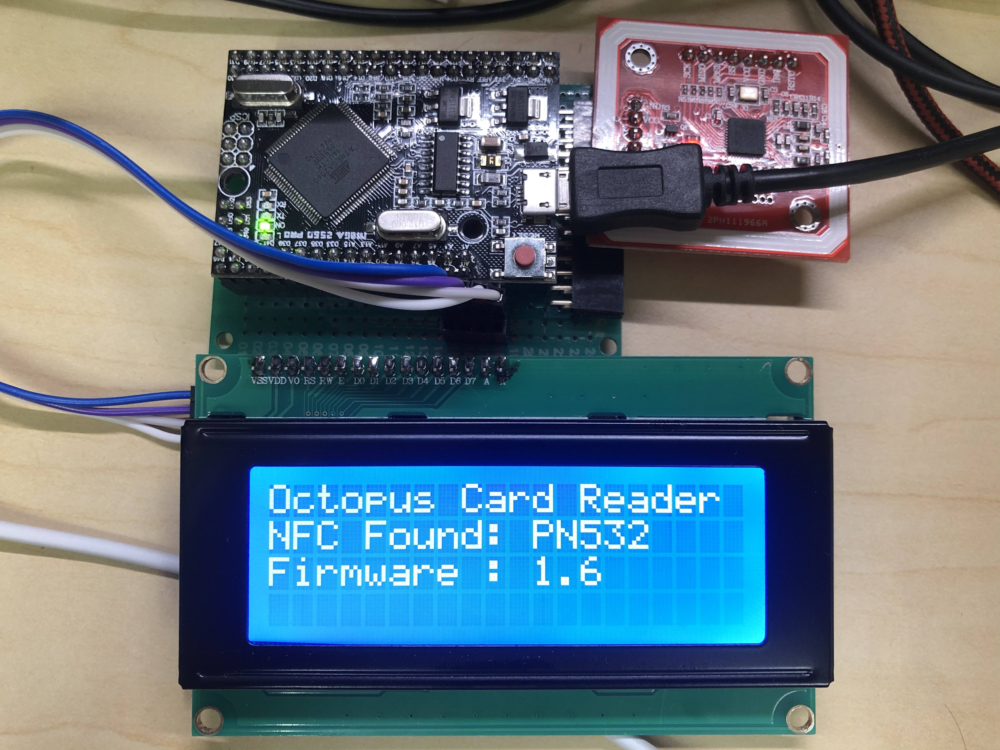
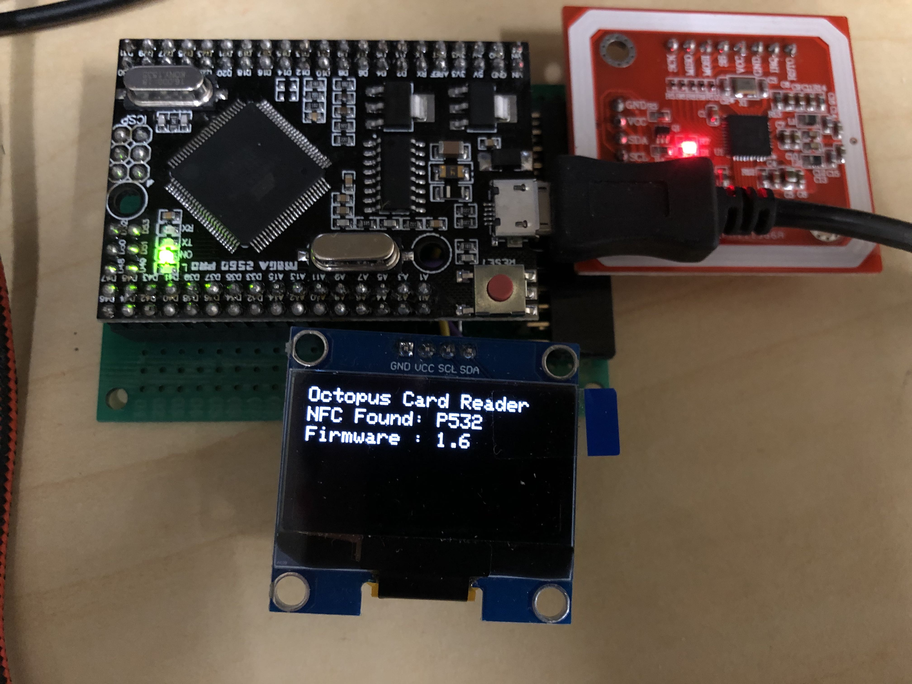

# Arduino Apple Pay Octopus Card Reader

[](https://youtu.be/H8cRV5nNZq4)

^ Click this photo to view the demo video.

# Introduction

Read the Card ID and Balance on apple pay Octopus Card.


# Supported Hardware

PN532 NFC chip

Arduino Mega 2560

Tested on Octopus Card.

Tested on Smart Octopus on iPhone X and Apple watch series 5.

# Installation

### Install PN532 NFC Arduino Library

Download the [Seeed-Studio PN532 NFC Library](https://github.com/Seeed-Studio/PN532).

Put all of the necessary files to one Folder and put this folder to Arduino library directory.

```
# Necessary files: 
PN532.cpp
PN532.h
PN532Interface.h
PN532_HSU.cpp
PN532_HSU.h
PN532_I2C.cpp
PN532_I2C.h
PN532_SPI.cpp
PN532_SPI.h
PN532_SWHSU.cpp
PN532_SWHSU.h
PN532_debug.h
```

### Arduino i2c Library Modification

To read the octopus card balance value correctly, you need to modify the Arduino I2C buffer from `32` to `64` in `Wire.h` and `twi.h`

```bash
# File: ${Arduino}/Java/hardware/arduino/avr/libraries/Wire/src/Wire.h
28c28
< #define BUFFER_LENGTH 32
---
> #define BUFFER_LENGTH 64
```

```bash
# File: ${Arduino}/Java/hardware/arduino/avr/libraries/Wire/src/utility/twi.h
32c32
<   #define TWI_BUFFER_LENGTH 32
---
>   #define TWI_BUFFER_LENGTH 64
```

### [Optional] Install Display driver

Install the optional display driver from Arduino Library Manager

#### LCD1602 / LCD2004 driver
Install [LiquidCrystal_I2C](https://github.com/johnrickman/LiquidCrystal_I2C)
#### SSD1306
Install [Adafruit_SSD1306 library](https://github.com/adafruit/Adafruit_SSD1306)

# Usage
Flash the program to any Arduino Board. i2c connection is recommended.

# Implementation

You need to follow the Felica reading procedure to establish a correct Apple Pay Octopus Card reading. 

Step:
1. Polling the card
2. Request card service
3. Read without encryption
4. Release the FeliCa card

#### Step 1 - Polling the card
You need to use systemCode=`0x8008` to trigger Apple Pay Express Transit Mode.

RequestCode can be either `0x00` or `0x01`.

`0x00` = Request Nothing.

`0x02` = Request felica system code

`0x03` = Request Felica Performance Index
.
```bash
# Code Reference
nfc.felica_Polling(systemCode, requestCode, ...);
```

#### Step 2 - Request card service
You need to use serviceCode=0x0117 to get the balance value.

If this function call is omitted, the apple pay system cannot show the complete signal until timeout. But the card data can still be obtained.

```bash
# Code Reference
nfc.felica_RequestService(..., serviceCodeList, ...)
```

#### Step 3 - Read without encryption
Similar to Step 2, use serviceCode=`0x0117` and blockID=`0x8000` to read the Octopus Card Balance.

You need to deduce the card reading by `350` / `500` to obtain the correct balance value.


```bash
# Code Reference
nfc.felica_ReadWithoutEncryption(..., serviceCodeList, ..., blockList, ...)
```

#### Step 4 - Release the FeliCa card

Release the Card after the reading procedure.

```bash
# Code Reference
nfc.felica_Release()
```

# Disclaimer

Using this software and hardware design improperly may damage your phone and Octopus Card. You follow the steps at your own risk. I am not to be held liable for your belongings.

# Photo




# Reference
https://github.com/Seeed-Studio/PN532
https://github.com/metrodroid/metrodroid/wiki/Octopus
https://blog.kalan.dev/core-nfc-en/
https://github.com/kk-lai/octopus_reader